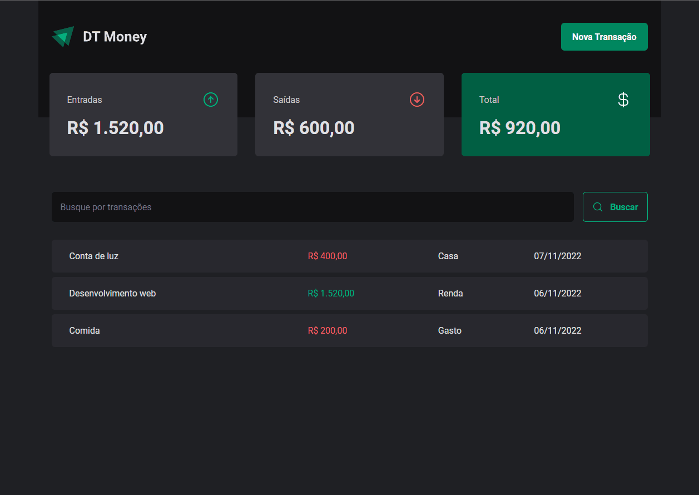
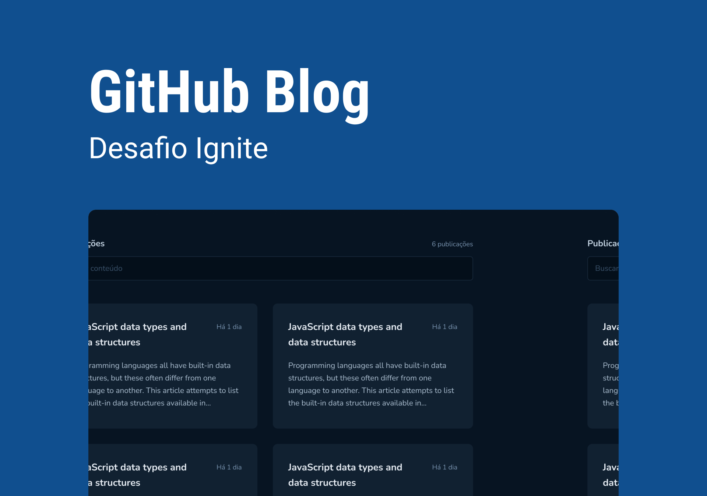
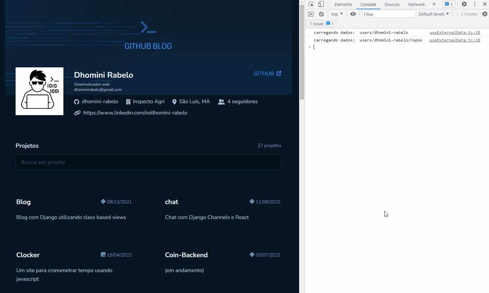
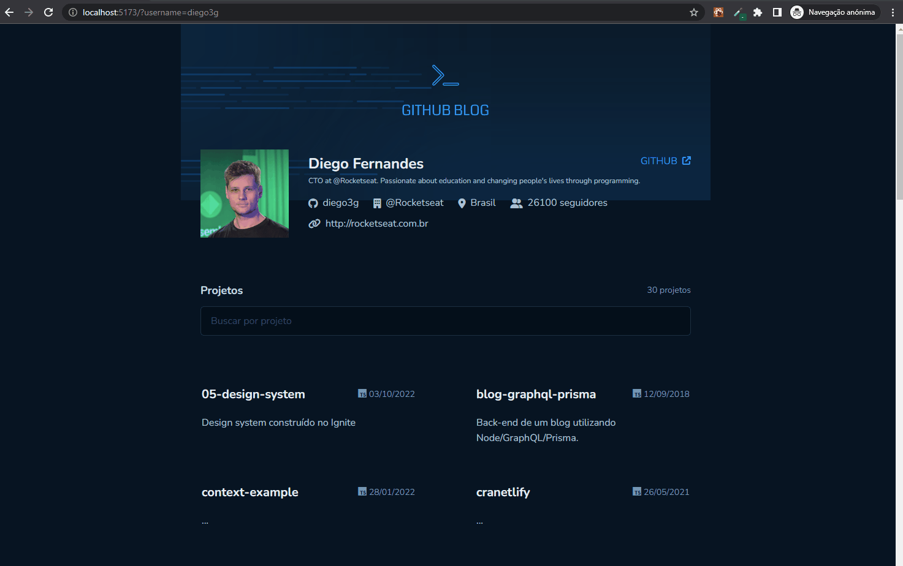

<h1>Estudos Ignite(React) - Etapa 03</h1>

<h3>Tópicos</h3>

<ul>

<li><a href="#course">Projeto feito durante as aulas</a></li> 
<li><a href="#course-individual">Projeto do curso feito individualmente</a></li> 
<!-- <li><a href="#external-project">Projeto externo feito individualmente</a></li>  -->

</ul>

 

<h2 id="course">Projeto feito durante as aulas</h2>

caminho: "/projects/stage03"

 

    Este é um projeto simples de gerenciamento de finanças, onde você consegue cadastrar seus gastos e 
    ganhos, visualizá-los, filtrá-los e ver um resumo. O principal objetivo deste projeto é a prática utilizando uma API 
    para construir as telas, e também analisar o impacto de rerenderizações em uma aplicação React(causadas por API ou não), 
    durante este módulo foi apresentado o conceito de useContextSelector, Memo, useMemo e useCallback.

<h3>🚀 Tecnologias</h3>
<ul>
    <li>Vite ts</li>
    <li>Tailwind</li>
    <li>Styled-components</li>
    <li>Phosphor-react</li>
    <li>react-router-dom</li>
    <li>radix</li>
    <li>axios</li>
    <li>zod</li>
</ul>

 
 
<h2 id="course-individual">Projeto do curso feito individualmente</h2>

caminho: "/projects/practice03"

 

    Este é um projeto de uma página de blog, onde consumindo a API do github, trazemos dados e informações de um
    determinado usuário ou repositório. Visualize todas as principais features abaixo:

<h3>🚀 Tecnologias</h3>
<ul>
    <li>Vite ts</li>
    <li>Tailwind</li>
    <li>Styled-components</li>
    <li>Phosphor-react e fontawesome</li>
    <li>date-fns</li>
    <li>react-router-dom</li>
    <li>react-hook-form</li>
    <li>zod</li>
</ul>

 
 
<h2>💻 Projeto</h2>

<ul>

<li style="margin-top: 30px;">
<h3>Home</h3>

Aqui podemos ver as principais informações do usuário, além de poder visualizar e filtrar(por nome, descrição ou linguagem)
todos os seus repositórios.

 
<kbd></kbd>
</li>

<li style="margin-top: 30px;">
<h3>Visualização de repositório</h3>

Nesta página está as principais informações do repositório, e também seu README.md

 
<kbd></kbd>
</li>

<li style="margin-top: 30px;">
<h3>Renderizações</h3>

Neste projeto foi implementado um hook para controlar as requisições a uma API externa, como pode perceber no gif,
os dados do usuário e dos repositórios são buscados apenas uma vez, depois eles são armazenados na context API.

 
<kbd></kbd>
</li>

<li style="margin-top: 30px;">
<h3>Trocar usuário padrão</h3>

Como os dados são buscados numa API externa de acordo com o username do usuário,
criei uma feature para trocar o usuário padrão apenas trocando uma variável na url.

 
<kbd></kbd>
</li>

<li style="margin-top: 30px;">
<h3>Trocar usuário padrão</h3>

Como os dados são buscados numa API externa de acordo com o username do usuário,
criei uma feature para trocar o usuário padrão apenas trocando uma variável na url.

 
<kbd></kbd>
</li>

<li style="margin-top: 30px;">
<h3>Erros</h3>

Retorno quando ocorre erros nas requisições.

 
<kbd></kbd>
</li>

</ul>

 
 
<!-- <h2 id="external-project">Projeto externo feito individualmente, para praticar ainda mais os conceitos</h2>

<strong>Link:</strong> <a href="https://github.com/dhomini-rabelo/chat">https://github.com/dhomini-rabelo/chat</a>
 -->